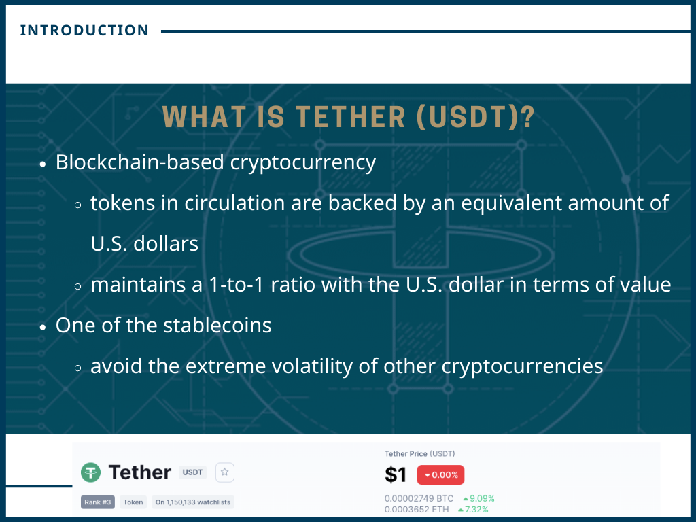
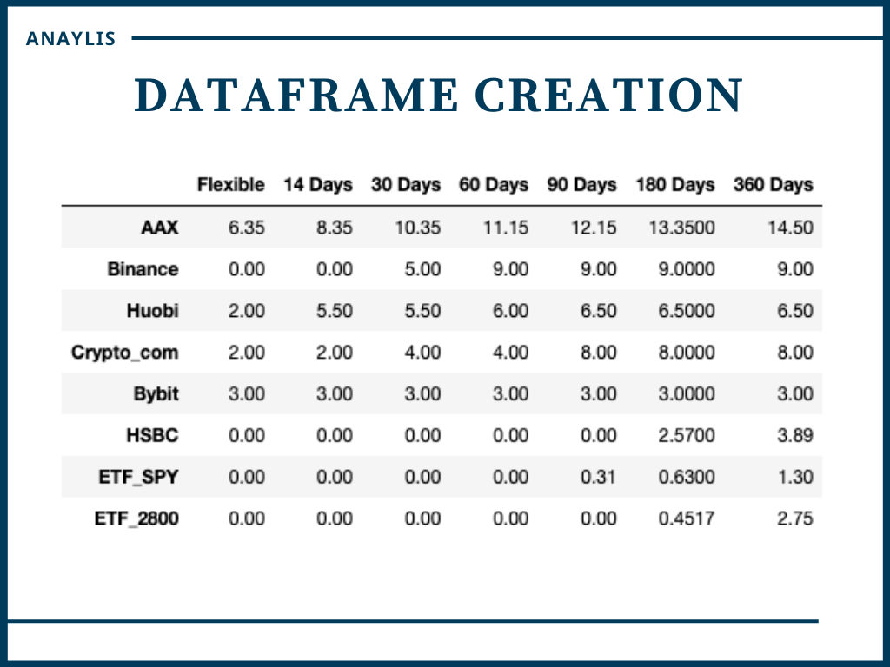
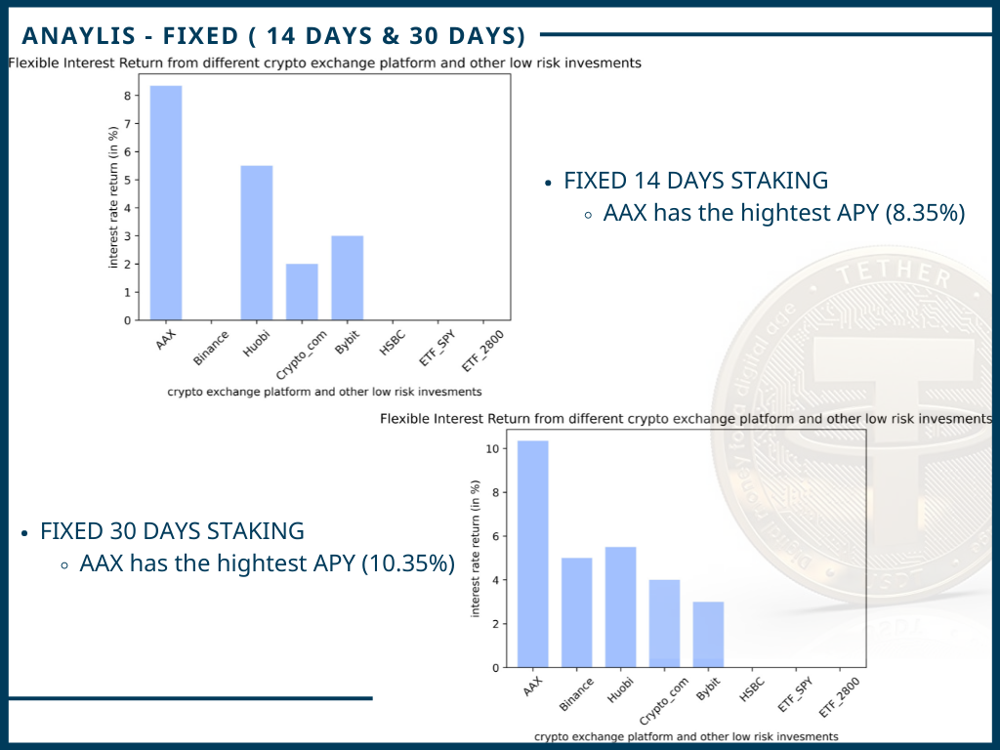
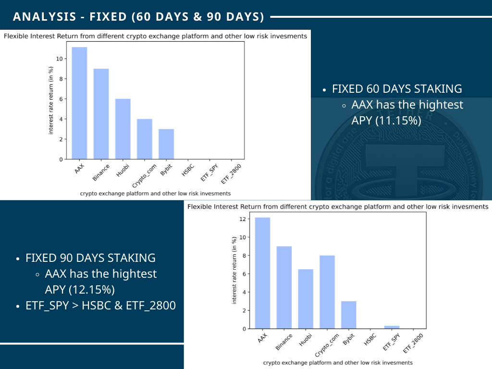
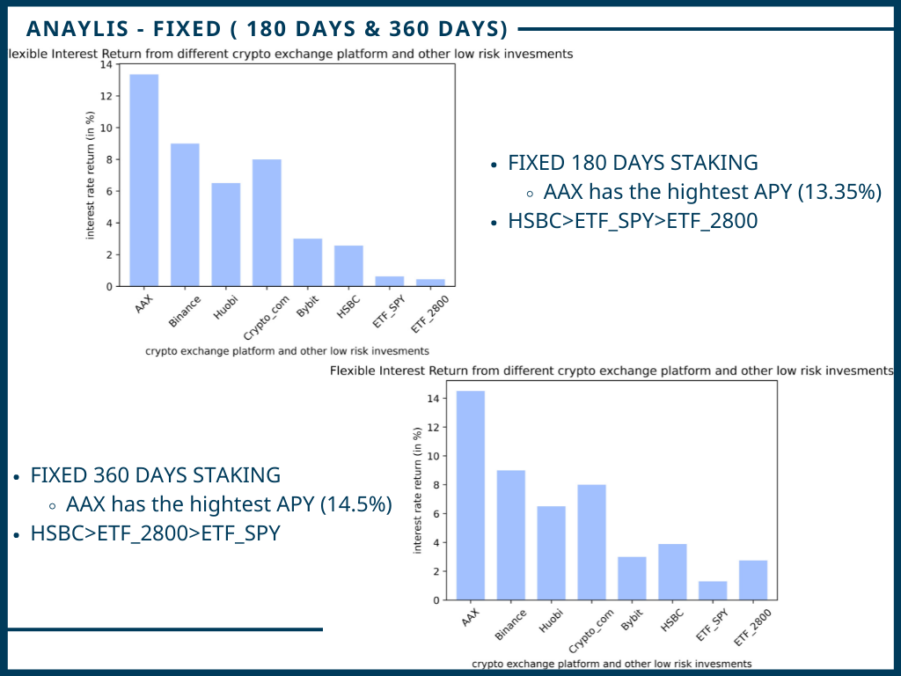

# USDT-staking-return-data-analysis

## What is Tether(USDT)?

## The portential usage

## Project methodology

#### 1. Study website structure and select data for analysis 

#### 2. Collect interest rate return from 5 crypto exchange platforms and other popular low risk investment from AAstock

#### 3. Compile a list and create a dataframe 

## Web scraping methods

## Data cleaning methods

## DataFrame

## Additional information

## Result

#### Flexible

#### FIXED ( 14 DAYS & 30 DAYS )

#### FIXED ( 60 DAYS & 90 DAYS )

#### FIXED ( 180 DAYS & 360 DAYS)

## HEATMAP (in %)

> For web-scriping, please refer to : low-risk-investment and diff-crypto-exchange-platform folder

> For visualization, please refer to : turning the result into dataframe&graph.ipynb
